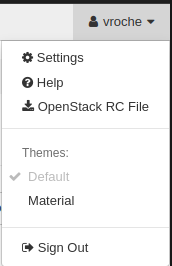
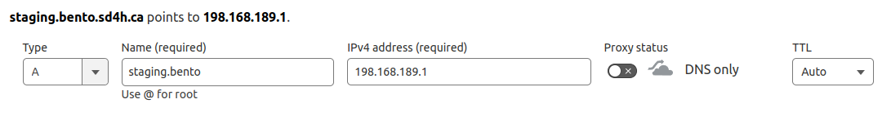
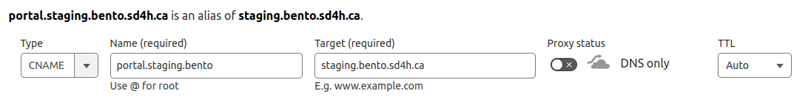

# Bento provisioning tools

This repository contains the required tools and documentation required to deploy a Bento instance on the SD4H cloud with OpenStack.

## Requirements

### OpenStack CLI

Install the OpenStack CLI using the official [documentation](https://docs.openstack.org/newton/user-guide/common/cli-install-openstack-command-line-clients.html).
This CLI is used to manage resources in the OpenStack cloud.
### OpenStack auth file

The OpenStack cloud is protected by authentication. If you have a valid account, login to the OpenStack instance in a browser.
Once logged-in, you need to click on your account in the top-right corner and select the `OpenStack RC File` button.



You can then open a terminal window and source the file in order to load the necessary variables for OpenStack CLI authentication.

```bash
# Load auth variables
source Bento-openrc.sh

# Will prompt you for your password
openstack server list
```

## Create a new Bento project node

### Prepare the resources config

Create a new resources configuration file from the template.

```bash
cp configs/config_template.sh configs/<project>_config.sh
```

In the `<project>_config.sh` file, modify the values for the project's name, data volume size, flavor and OS image accordingly.

```bash
# Instance specific configs
PROJECT_NAME=bento-staging
DATA_VOLUME_SIZE=1000
FLAVOR="ha4-15gb"
IMAGE="Rocky-8.9-x64-2023-11"
```

### Create the server on OpenStack

The `bento_openstack_cli.sh` script can be used to quickly create a new Bento node.
It uses the `openstack` cli to create the server (VM) with required volumes and network interfaces.
The `cloud-config` file `template_bento.yaml` is used to setup the users, authorised SSH keys, and mounts.

Usage example:

```bash
# Lauch the node creation script with a config argument
bash bento_openstack_cli.sh configs/<project>_config.sh

# The script will ask to validate the project's name from the config

# If all went well, you should see the new instance
openstack server list

# If your ssh key is listed in template_bento.yaml and the server has a floating IP, you can ssh with:
ssh bento@<floating-ip>
```


#### Security group for SSH

If the security group `obentoyasan-secgroup` is not available in OpenStack, you need to create.

Add the new ssh port to the `obentoyasan-secgroup` security group:
```
openstack security group rule create obentoyasan-secgroup   --protocol tcp --dst-port 2222:222<N+1> --ingress --remote-ip 0.0.0.0/0
```
list and remove the old 2222:222<N> rule :
```openstack security group rule list

openstack security group rule delete <ID>
```

### Prepare the deployment on the server

Now that you can SSH on the server, we need to setup the Bento repository for deployment.

#### Init the Bento project directory

```bash
# connect to the server
ssh bento@<floating-ip>

# move to the /data directory
cd /data

# clone the Bento repo
git clone https://github.com/bento-platform/bento.git

# create the data directory
mkdir -p bento_data

# cd to the bento directory and configure the Bento instance
cd bento

# Follow the Bento installation instructions
# create venv for bentoctl
# create local.env config file for PROD
```
The installation [instructions](https://github.com/bento-platform/bento/blob/main/docs/installation.md) for Bento are found in the repository's documentation.

For next steps, you must have a local.env file with the variable `BENTOV2_DOMAIN` set to a SD4H subdomain specific to the project:

```bash
BENTOV2_DOMAIN=<project-name>.bento.sd4h.ca
```

### Create the DNS records

In order to obtain SSL certificates, we must first create the DNS records that will be used by the new Bento node.

At most, a bento node will require a DNS record for the following domains:

| Bento local.env variable  | Domain                             | Record type | Content               | Condition                  |
|---------------------------|------------------------------------|-------------|-----------------------|----------------------------|
| BENTOV2_DOMAIN            | <project>.bento.sd4h.ca            | A           | <node's floating IP>  | Always                     |
| BENTOV2_PORTAL_DOMAIN     | portal.<project>.bento.sd4h.ca     | CNAME       | staging.bento.sd4h.ca | Always                     |
| BENTOV2_AUTH_DOMAIN       | auth.<project>.bento.sd4h.ca       | CNAME       | staging.bento.sd4h.ca | If using internal IDP only |
| BENTOV2_CBIOPORTAL_DOMAIN | cbioportal.<project>.bento.sd4h.ca | CNAME       | staging.bento.sd4h.ca | If using cbioportal only   |


In the Cloudflare DNS management page, the creation of the record for `staging.bento.sd4h.ca` would look like this:




Make sure that the `Proxy status` option is set to `DNS only` for all records.

We create the `A` record first, so that we can then make the other `CNAME` records point to it.




Once the records are registered with the DNS server, you should be able to ssh the node using the domain name instead of the IP.

```bash
ssh bento@<project>.bento.sd4h.ca
```

For the next step, make sure all the DNS records you need certificates for are registered.

### Create the initial SSL certificates

With DNS records in place, we can ssh back to the server and request SSL certificates for our domains.
Make sure that Bento's local.env file is configured to use the domains for the newly created records.

Use the convenience script provided by Bento to request the initial SSL certificates from LetsEncrypt:

```bash
# from /data/bento in the server
cd ./etc/scripts

# Run the convenience script
bash init_certs_only.sh
# BEGIN init_certs_only.sh

# Will attempt a dry-run first

# Stopping gateway...
# Creating certificates for domains: -d staging.bento.sd4h.ca -d portal.staging.bento.sd4h.ca

# How would you like to authenticate with the ACME CA?
# SELECT OPTION 1

# Enter your email adress if prompted
# Accept LetsEncrypt user terms if prompted

# If dry-run ok, create real certs

# Repeat for auth
# END init_certs_only.sh

# go back to Bento dir
cd /data/bento

# check that the certs were created and are owned by the 'bento' user

# Should contain dirs <project>.bento.sd4h.ca, portal.<project>.bento.sd4h.ca
ls -la certs/gateway/letsencrypt/live/

# Should contain dir auth.<project>.bento.sd4h.ca
ls -la certs/auth/letsencrypt/live/
```

After creating the certificates, make sure that the certificates relative paths variables in `local.env` 
are configured to point to the right paths.

```bash
# local.env
BENTOV2_GATEWAY_INTERNAL_FULLCHAIN_RELATIVE_PATH=/live/<project>.bento.sd4h.ca/fullchain.pem
BENTOV2_GATEWAY_INTERNAL_PRIVKEY_RELATIVE_PATH=/live/<project>.bento.sd4h.ca/privkey.pem
BENTOV2_GATEWAY_INTERNAL_PORTAL_FULLCHAIN_RELATIVE_PATH=/live/portal.<project>.bento.sd4h.ca/fullchain.pem
BENTOV2_GATEWAY_INTERNAL_PORTAL_PRIVKEY_RELATIVE_PATH=/live/portal.<project>.bento.sd4h.ca/privkey.pem
BENTOV2_AUTH_FULLCHAIN_RELATIVE_PATH=/live/auth.<project>.bento.sd4h.ca/fullchain.pem
BENTOV2_AUTH_PRIVKEY_RELATIVE_PATH=/live/auth.<project>.bento.sd4h.ca/privkey.pem
```


### Start Bento

At this point the configuration of `local.env` should be complete, we can now finalize the deployment and start Bento.

```bash
# in /data/bento

# Open bentoctl venv
source env/bin/activate

# Pull the Bento Docker images
./bentoctl.bash pull

# Initialize the data directories
./bentoctl.bash init-dirs

# Initialize the data Docker networks
./bentoctl.bash init-docker

# Start Bento!
./bentoctl.bash run
```

Wait a minute for all the containers to start, you can check the status of the containers with `docker ps -a`.
If a Bento container has an `exited` status, check its logs with `./bentoctl.bash logs <service-name>` and try to diagnose the issue.

When all containers are up, you can open a browser window and navigate to your brand new Bento node!

## On the proxy server

Setup the stream.conf_tpl file to <project>.conf and copy it to
`/etc/nginx/stream.d folder`

Do the same thing for the https setup
```
cat nginx_config.conf_tpl  | sed 's/<project>/bcq19/'  > bcq19.conf_tpl
```
to be copied to
`/etc/nginx/conf.d`


add the new node ip in the `/etc/host` file. Open the new ssh port to selinux

```
semanage port -a -t http_port_t -p tcp 2224
```

add the new letsencrypt adress


```
certbot certonly  --nginx  -w /usr/share/nginx/html -d bqc19.c3g.calculquebec.ca
```

restart nginx


```
systemctl restart nginx
```
